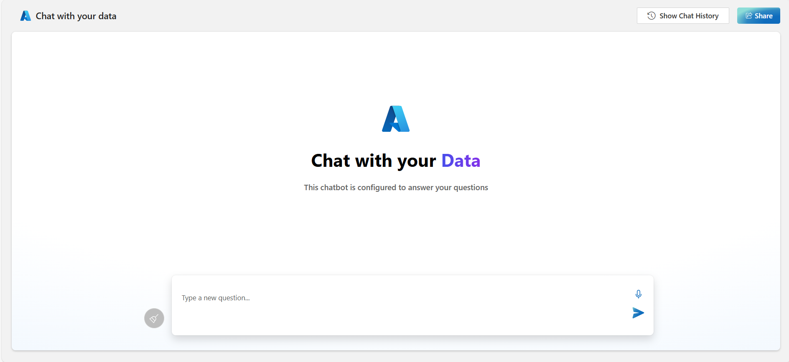

# Sample Questions

To help you get started, here are some **Sample Prompts** you can ask in the app:

### **Chat with Your Data**

_Sample Questions:_

- How do I enroll in health benefits as a new employee?
- What options are available to me in terms of health coverage?
- What providers are available under each option?
- Can I access my current provider?
- What benefits are available to employees (besides health coverage)?
- How do I enroll in employee benefits?
- Can I extend my benefits to cover my spouse or dependents?
  
The Chat with Your Data Solution Accelerator lets users interact with their data through natural language queries. It provides instant, AI-driven answers and insights from uploaded documents.
